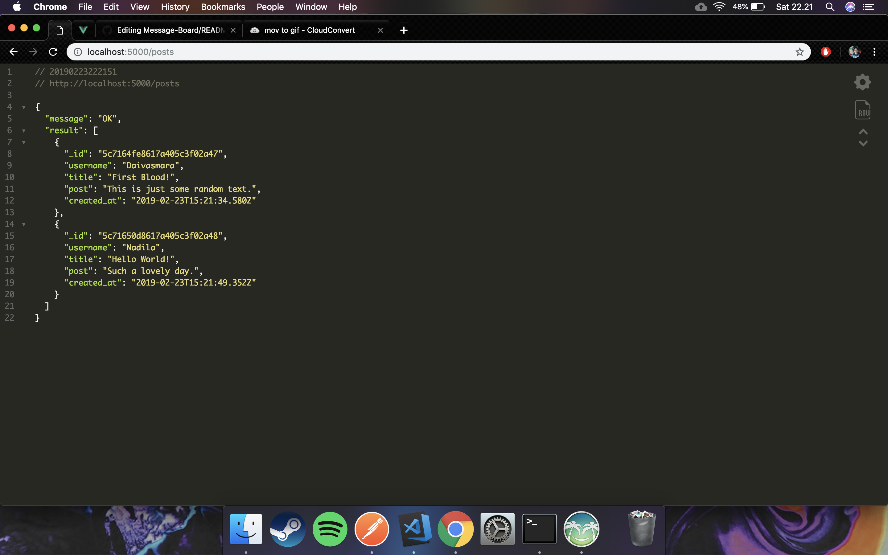

# Full-Stack Blog!

A simple Fullstack Blog created with MEVN stacks (MongoDB, Express, Vue.js, Node.js)! This is my own learning project to experiment with monk and joi. This blog able to do all CRUD (Create, Read, Update and Delete) functions and has a solid validation system.

## Client

## Server

## Built with

### Client Side

* [Vue.js](https://vuejs.org/) - JavaScript Framework
* [Skeleton](http://getskeleton.com/) - CSS Framework

### Server Side

* [MongoDB](https://www.mongodb.com/) - NoSQL Database
* [Express](http://expressjs.com/) - Node.js Framework
* [Joi](https://www.npmjs.com/package/joi) - Schema validator
* [Monk](https://www.npmjs.com/package/monk) - MongoDB connection helper
* [Morgan](https://www.npmjs.com/package/morgan) - Node.js request logger middleware
* [Nodemon](https://www.npmjs.com/package/nodemon) - Automatic server restarter when change detected

## Author

* **Muhammad Daivasmara Denaw** - [Daivasmara](https://github.com/Daivasmara)
